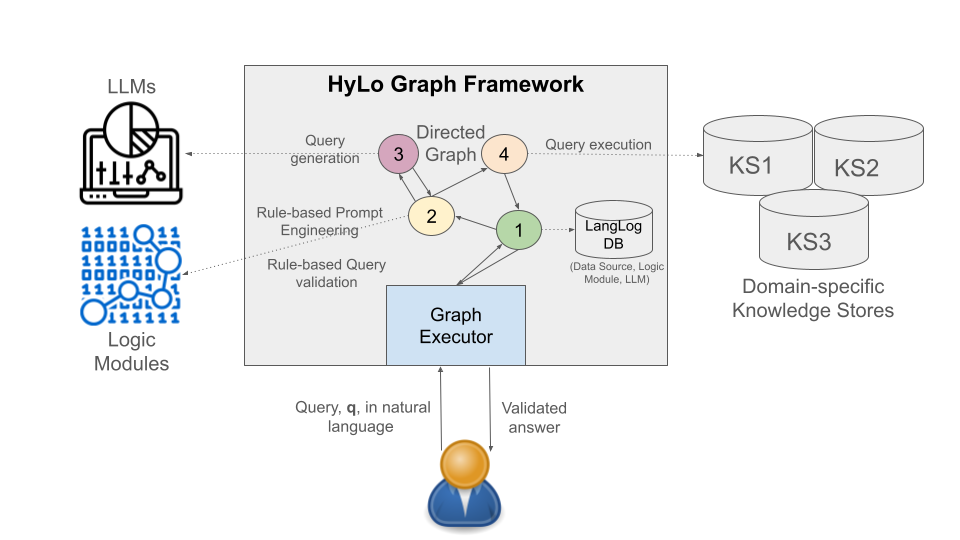

Overview
---------

Hylo Graph provides a framework for rapidly developing hybrid logic-language model enabled applications that 
provide natural language interfaces to knowledge representations. An overview is depicted in the following
figure.




Installation
------------
Currently, the code requires a Python poetry environment. See the pyproject.toml in the project root. 


Execution
----------

Main entrypoint is run.py, which will execute the chatbot:

```
python run.py
```