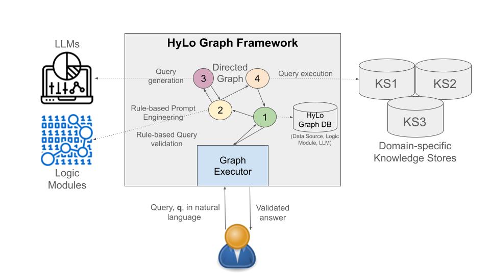

# Overview


Hylo Graph provides a framework for rapidly developing hybrid logic-language model enabled applications that 
provide natural language interfaces to knowledge representations. An overview is depicted in the following
figure.




# Installation

Currently, the code requires a Python poetry environment. See the pyproject.toml in the project root. 


# Execution


Main entrypoint is run.py; we have a CLI interface based on the click library; refer to the help for details.

```
python run.py --help
```

There are two modes for executing the framework:
an interactive "chatbot" mode and a "benchmark"
mode for executing a test suite against an 
application. Both modes require an `app` object
which provides high-level configuration of 
the application. 

Currently, two applications are available:
`demo`, which utilized the [Neo4J Demo Movie Recommendations
Database](https://github.com/neo4j-graph-examples/recommendations)
and `astria`, which utilizes the ASTRIAGraph
application. Note that 
the `astria` application requires you to run the ASTRIAGraph database locally. 

## Chatbot Mode

To execute the framework in chatbot mode, run a command similar to:

```
python run.py chatbot --app demo
```

This will start up the application's CLI prompting the operator
for an input, executing the graph, and returning the result; e.g., 

```
User: : Who directed the movie Toy Story?

. . . Executing node_get_question_similarity . . 

Assistant: Answer: [{'d.name': 'John Lasseter'}]
Assistant: Here is the query that was used: MATCH (m:Movie {title: 'Toy Story'})<-[:DIRECTED]-(d) RETURN d.name
```

Type `quit` or `exit` to exit the program. 

## Benchmark Mode

The benchmark mode can be used to evaluate a graph against 
a dataset. The benchmark mode requires an additional input
in the form of a JSON file containing the benchmark to use.
This JSON file should contain a list of dictionaries with 
each dictionary containing the following keys:

* `question`: A question, in natural language, to send to the application.
* `query`: The correct database query associated with the question.

Note that we are also developing a framework for generating
benchmarks automatically by inspecting the graph's schema. This
work is based on the Neo4JLabs [text2cypher](https://github.com/neo4j-labs/text2cypher/tree/main) code
repository and is available from within the 
[samples_builder](samples_builder) directory. See 
the [README](samples/builder/README.md) there for
instructions. 

To execute the framework in benchmark mode, run a command similar to:

```
python run.py benchmark --app demo --benchmark /path/to/benchmark.json --outfile /path/to/output.csv
```

## Configuring Apps

The goal of this project is to make it straight-forward to configure
graphs for additional applications. The [apps](apps) directory 
contains the two examples mentioned above.

At a minimum, each application needs an app.py file. Within that
file should be defined the app's configuration dictionary; for 
example, inside [movie_demo.py](apps/movie_demo.py), we have the 
`movie_demo_text2cypher_app_config` dictionary. This dictionary
defines the key attributes that the hylograph execution engine
will use to execute the application, including:

* `hylograph`: The hylograph object to use, as a string; for example, "text2query_sim_graph_execute". The available graph
objects are defined in the [graphs.py](graphs.py) module. 
* `state`: The hylograph state class associated with the graph; for
example, "Text2QueryGraphExecuteState". The available state classes
are defined in the [states.py](states.py) module.
* `desc`: A short description to use in the CSV report files (needed 
for benchmark mode only). 

Additionally, configuration should be provided for connecting to the
database associated with the application. 
Finally, a set of optional config cab be provided for 
setting optional values, such as the type and version of Ollama model
to use.

# Design
Here we describe the desgin goals for the project. 

## Introduction

Key concepts: State, Nodes and Edges. 

The purpose of a Hylograph is to transform an initial provided state, for 
example, a question in natural language, to a final state that
includes an answer to the question. Nodes within the graph perform 
the actual computation on the state, while edges in the graph describe 
how to transition from one node to another. Edges can be *conditional*, 
meaning that they depend on the value of the current state. In this way,
a single node may have multiple conditional edges to other nodes in the 
graph. The edge that will be traversed depends on the value of the state 
after the node's computation completes. 

To illustrate, we consider the *text-to-query* problem where a user 
provides a question, in natural language, and we wish to generate a query 
to answer the question. A simple graph to solve this problem involves three nodes: 
Node 1 takes as input the user's question and generates a candidate query;
Node 2 takes as input the candidate query and performs some validation 
(e.g., syntax checking); Node 3 takes as input a query and executes it on 
the knowledge base. 

We connect these nodes with edges as follows: Node 1 is connected to Node 2
unconditionally while Node 2 is conditionally connected to Nodes 1 and 3, where
the condition to return to Node 1 is that the candidate query contained a 
syntax error.

Note that we can view nodes and edges as functions of the state object, `s`, 
and the set of nodes, `N`, in the graph, as follows: A node is a 
function, `n: s -> s`, which, for a given value of the state computes the nest 
value of the state; while an edge is a function `e: s -> N`, which, for a 
given value of the state, computes the next node to execute. 

## Goals 

*Reusability*.  We wish to define a set of interfaces that enable reusable nodes 
and edges across graphs and state types. The idea is to use attributes of the state 
object to define requirements of a node. For example, a query generator node 
(Node 1 in the example above) may require a `question` attribute in the state
and it may produce a `query` attribute, while a query validator node (Node 2 in the
example above) may require a `query` attribute in the state and it may produce a
`query_error` attribute (which would likely be an Optional type, i.e., `None` when 
`query` contains no error).

Moreover, the type of the state object associated with any graph is the sum of
all attributes associated with all nodes in the graph. 

A key challenge for this work is to identify the attributes that have *global* 
importance across a graph since a node in general has only a "local" view, and 
to provide a flexible mechanism by which nodes can work with these global 
instances. 

*Validation*. Given the description of a graph, we should be able
to validate the graph in the following way: a graph is *valid* if every edge
between two nodes, `n1` and `n2`, guarantees that the required state will be 
present at `n2` after the completion of `n1`. 

*Automated Graph Search*. A long-term goal is to automate the search for optimal
graphs. Given a benchmark, can we learn the shape of graphs that perform optimally
on the benchmark? The benchmark must describe the input and the output so that
possible initial and final nodes can be identified. Then, the search could 
explore all possible graphs formed by connecting zero the start and end node by 
or more intermediate nodes. There are infinitely many graphs in general since, 
for example, a cycle of arbitrary depth could be introduced. 
Validation is a necessary ingredient, since we will want to rule out invalid 
graphs.
